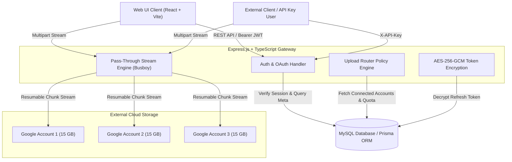

# Product Requirements Document (PRD) & System Architecture
## Multi-Account Google Drive Virtual Cloud Storage Gateway

---

## 1. Executive Summary
This project aims to build a modern, high-performance, self-hosted **Virtual Cloud Storage Gateway** web application. The platform enables users to aggregate multiple Google Drive accounts (and optionally S3-compatible storage providers) into a unified, single-pane-of-glass storage dashboard.

Key objectives:
- **Storage Pooling**: Merge multiple 15GB free Google Drive accounts into a unified virtual quota (e.g., 3x Google Accounts = 45GB virtual storage).
- **Zero Local Disk Overhead**: Stream uploads and downloads directly through backend memory streams to Google Drive API without storing binary files on server disk.
- **Smart Upload Routing**: Automatically route file uploads to the connected storage account with the largest available free space (or via round-robin/priority policies).
- **Virtual Hierarchy**: Decouple physical Google Drive folder structures from the web UI using a virtual file system managed in a local relational database (MySQL/PostgreSQL).

---

## 2. Target User & Use Cases
- **Power Users / Freelancers**: Needing centralized management of multiple personal and work Google Drive accounts.
- **Developers**: Wanting a private, S3-like REST API gateway (`POST /api/v1/uploads`) backed by free Google Drive storage.
- **Teams**: Sharing files across virtual folders without exposing raw Google account credentials to end-users.

---

## 3. High-Level Architecture & Component Diagram

---

## 4. Key Functional Features

### 4.1 Authentication & Multi-Tenant Security
- **Email/Password & Google Sign-In**: Registration via email or 1-click Google OAuth.
- **Automatic First Account Connection**: When signing in with Google, automatically connect the user's primary Google Drive account.
- **Role & Scope Permissions**: Support for User and Admin roles.

### 4.2 Storage Account Management
- **Connect Multiple Drives**: OAuth 2.0 flow to link secondary Google Accounts.
- **Token Security**: OAuth `refresh_token` stored encrypted at rest in MySQL using AES-256-GCM (`TOKEN_ENCRYPTION_KEY`).
- **Quota Tracker**: Real-time quota calculation (Total Capacity, Used Bytes, Free Bytes, Account Status).

### 4.3 Virtual File System (VFS)
- **Virtual Folders**: Nested folder hierarchy managed via `VirtualFolder` model in DB.
- **File Actions**: Preview, Download, Rename, Move to Virtual Folder, Soft Delete / Permanent Delete.
- **Drive Sync**: Re-synchronize local DB metadata with physical Google Drive files inside the root `9drive` folder if modified directly on Google Drive.

### 4.4 Upload Router Engine
When a user uploads a file, the backend evaluates the active connected accounts based on the selected policy:
1. **Most Available Space (Default)**: Pick the account with `(total_quota - used_quota)` max.
2. **Round Robin**: Distribute files sequentially across connected accounts.
3. **Priority Order**: Fill account #1 to capacity before routing to account #2.

### 4.5 Personal Multi-Drive Vault UI Experience
The web client implements a **Personal Multi-Drive Vault** layout as documented in [UI_REQUIREMENTS_SPECIFICATION.md](file:///d:/Enuma/Riset/9%20Drive%20-%20Cloud%20Storage%20Via%20Google/UI_REQUIREMENTS_SPECIFICATION.md):
- **Quota Visualizer Bar**: Color-coded segmented storage bar showing combined capacity across all linked accounts.
- **Unified File Browser**: Single virtual file manager displaying files with account origin badges.
- **Drag & Drop Upload Widget**: Interactive upload zone with live routing preview and floating upload progress drawer.

---

## 5. Non-Functional & Security Requirements
1. **Zero-Disk Streaming**: Backend MUST NOT write uploaded multipart files to temporary local disk directories. Use Busboy / Node stream pipes directly to Google Drive API.
2. **Token Encryption**:
   - `algorithm`: `aes-256-gcm`
   - Key length: 32 bytes (256 bits) secret key.
   - IV: 12-byte random IV per encrypted string.
   - Auth Tag: 16-byte authentication tag appended to payload.
3. **Resumable Upload Chunking**: For files larger than 5MB, use Google Drive Resumable Upload protocol to prevent HTTP request timeouts.
4. **Rate Limiting & CORS**: Enforce CORS headers for frontend domain and rate limiting (e.g. 100 requests / 15 minutes per IP).

---

## 6. Development & Deployment Stack
- **Frontend**: React 18, Vite, Tailwind CSS, Axios, Lucide React.
- **Backend**: Node.js 20+, Express.js, TypeScript, Busboy, `googleapis` SDK.
- **Database**: MySQL 8+ / PostgreSQL with Prisma ORM.
- **Containerization**: Docker Compose (`docker-compose.yml` with Nginx, Express, and MySQL).
